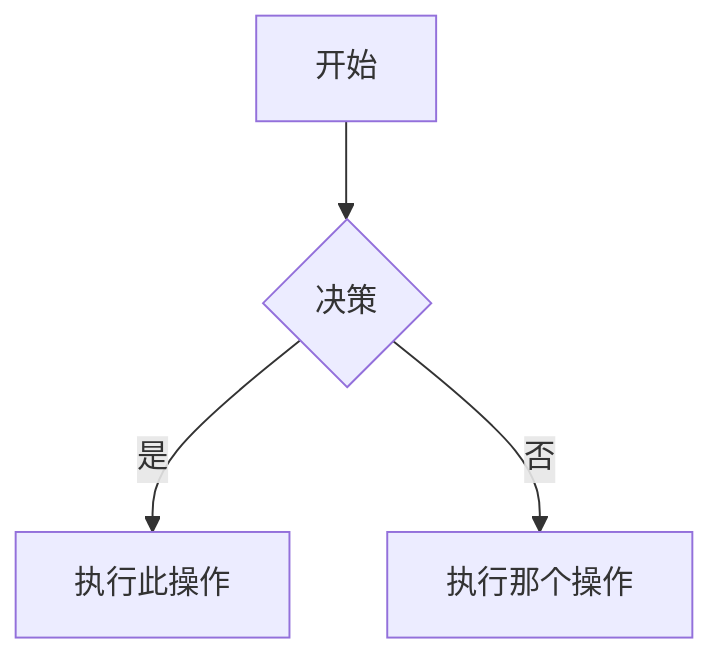

# Obsidian 风格 Markdown 技能

创建和编辑有效的 Obsidian 风格 Markdown 文件。Obsidian 在 CommonMark 和 GFM 的基础上扩展了 Wiki 链接、内嵌文件、标注框、属性、注释等语法。本技能只涵盖 Obsidian 专有的扩展语法——标准 Markdown（标题、粗体、斜体、列表、引用、代码块、表格）视为已知知识。

## 工作流：创建 Obsidian 笔记

1. **添加 Frontmatter**：在文件顶部添加属性（标题、标签、别名）。
2. **编写内容**：使用标准 Markdown 结构，加上下面的 Obsidian 专有语法。
3. **链接相关笔记**：使用 Wiki 链接（`[[笔记名]]`）建立库内连接，外部 URL 使用普通 Markdown 链接。
4. **嵌入内容**：使用 `![[嵌入]]` 语法嵌入其他笔记、图片或 PDF。
5. **添加标注框**：使用 `> [!类型]` 语法高亮重要信息。
6. **验证**：在 Obsidian 阅读视图中确认笔记渲染正确。

## 内部链接（Wiki 链接）

```markdown
[[笔记名]]                          链接到笔记
[[笔记名|显示文本]]                 自定义显示文本
[[笔记名#标题]]                     链接到标题
[[笔记名#^块ID]]                    链接到块
[[#同笔记中的标题]]                 同笔记内标题链接
```

## 嵌入文件

在任意 Wiki 链接前添加 `!` 即可内联嵌入其内容：

```markdown
![[笔记名]]                         嵌入完整笔记
![[笔记名#标题]]                    嵌入章节
![[image.png]]                      嵌入图片
![[image.png|300]]                  指定宽度嵌入图片
![[document.pdf#page=3]]             嵌入 PDF 指定页
```

## 标注框（Callouts）

```markdown
> [!note]
> 基础标注。

> [!warning] 自定义标题
> 带自定义标题的标注。

> [!faq]- 默认折叠
> 可折叠标注（- 折叠，+ 展开）。
```

常用类型：`note`、`tip`、`warning`、`info`、`example`、`quote`、`bug`、`danger`、`success`、`failure`、`question`、`abstract`、`todo`。

## 属性（Frontmatter）

```yaml
---
title: 我的笔记
date: 2024-01-15
tags:
  - 项目
  - 进行中
aliases:
  - 别名
cssclasses:
  - 自定义样式
---
```

## 标签

```markdown
#标签                   内联标签
#嵌套/标签              嵌套标签层级
```

## 注释

```markdown
这是可见文字 %%但这部分是隐藏的%% 文字。

%%
这整个块在阅读视图中是隐藏的。
%%
```

## Obsidian 专有格式

```markdown
==高亮文字==                        高亮语法
```

## 数学公式（LaTeX）

```markdown
行内: $e^{i\pi} + 1 = 0$

块级:
$$
\frac{a}{b} = c
$$
```

## Mermaid 图表

````markdown

````

## 参考资料

- [Obsidian 风格 Markdown](https://help.obsidian.md/obsidian-flavored-markdown)
- [内部链接](https://help.obsidian.md/links)
- [嵌入文件](https://help.obsidian.md/embeds)
- [标注框](https://help.obsidian.md/callouts)
- [属性](https://help.obsidian.md/properties)
