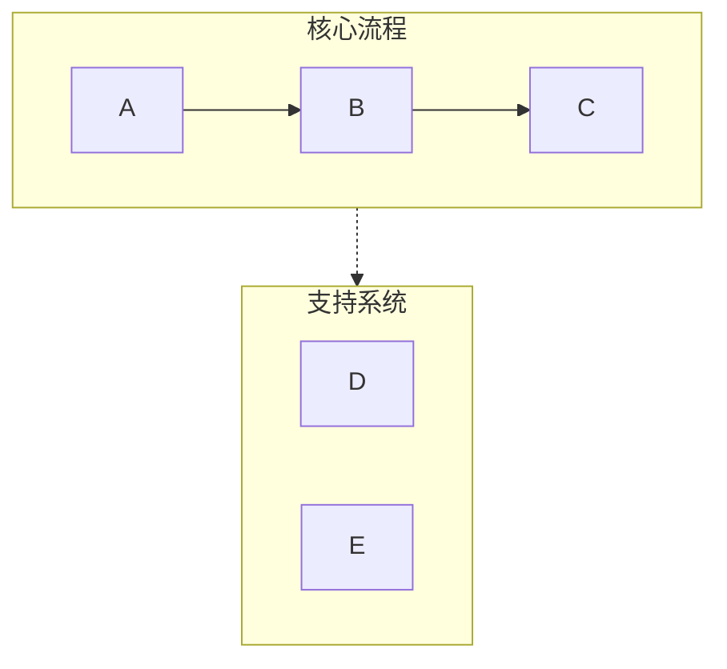
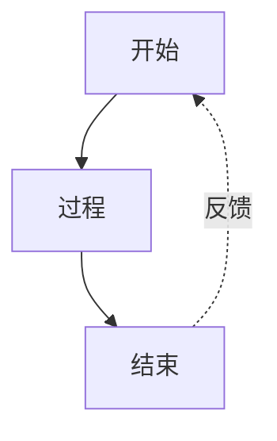
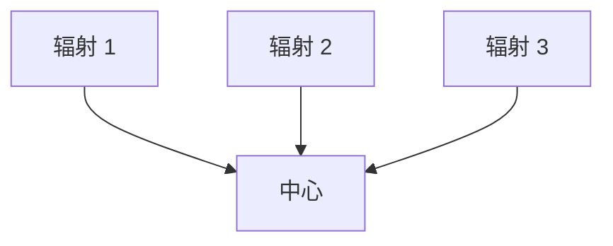

# Mermaid Visualizer

## 概述

将文本内容转换为干净、专业的 Mermaid 图表，适用于演示文稿和文档。自动处理常见的语法陷阱（列表语法冲突、子图命名、间距问题），以确保图表在 Obsidian、GitHub 和其他 Mermaid 兼容平台上正确渲染。

## 快速入门

当创建 Mermaid 图表时：

1. **分析内容** - 确定关键概念、关系和流程
2. **选择图表类型** - 选择最合适的可视化（见以下图表类型）
3. **选择配置** - 确定布局、详细程度和样式
4. **生成图表** - 创建语法正确的 Mermaid 代码
5. **以 Markdown 格式输出** - 使用适当的代码块包裹，可选添加解释

**默认假设：**
- 垂直布局（TB），除非请求水平布局
- 中等详细程度（在简洁和信息之间平衡）
- 专业的颜色方案，具有语义颜色
- 与 Obsidian/GitHub 兼容的语法

## 图表类型

### 1. 流程图 (graph TB/LR)
**最佳用途：** 工作流程、决策树、顺序流程、AI 代理架构

**使用场景：** 内容描述步骤、阶段或一系列动作

**关键特性：**
- 通过子图进行泳道分组相关步骤
- 箭头标签表示转换
- 反馈循环和分支
- 色彩编码的阶段

**配置选项：**
- `layout`: "vertical" (TB)，"horizontal" (LR)
- `detail`: "simple" (仅核心步骤)，"standard" (包含描述)，"detailed" (包含注释)
- `style`: "minimal"，"professional"，"colorful"

### 2. 循环图 (graph TD with circular layout)
**最佳用途：** 循环过程、持续改进循环、代理反馈系统

**使用场景：** 内容强调迭代、反馈或循环关系

**关键特性：**
- 中央枢纽和辐射元素
- 曲线反馈箭头
- 清晰的循环指示器

### 3. 比较图 (graph TB with parallel paths)
**最佳用途：** 之前/之后比较、A 与 B 分析、传统与现代系统

**使用场景：** 内容对比两种或多种方法或系统

**关键特性：**
- 侧边布局
- 中央比较节点
- 通过颜色/样式清晰区分

### 4. 思维导图
**最佳用途：** 层次概念、知识组织、主题分解

**使用场景：** 内容是层次结构，具有清晰的父子关系

**关键特性：**
- 放射状树结构
- 多级嵌套
- 清晰的视觉层次

### 5. 顺序图
**最佳用途：** 组件之间的交互、API 调用、消息流

**使用场景：** 内容涉及随时间进行的演员/系统之间的通信

**关键特性：**
- 基于时间线的布局
- 清晰的演员分隔
- 过程激活框

### 6. 状态图
**最佳用途：** 系统状态、状态转换、生命周期阶段

**使用场景：** 内容描述状态及其之间的转换

**关键特性：**
- 清晰的状态节点
- 标记的转换
- 开始和结束状态

## 重要的语法规则

**始终遵循以下规则以防止解析错误：**

### 规则 1：避免列表语法冲突
```
❌ 错误：[1. 感知]       → 触发 "不支持的 Markdown：列表"
✅ 正确：[1. 感知]         → 删除句号后的空格
✅ 正确：[① 感知]         → 使用圆圈数字（①②③④⑤⑥⑦⑧⑨⑩）
✅ 正确：[(1) 感知]       → 使用括号
✅ 正确：[步骤 1：感知]   → 使用 "步骤" 前缀
```

### 规则 2：子图命名
```
❌ 错误：subgraph AI 代理核心  → 命名中包含空格且不带引号
✅ 正确：subgraph agent["AI 代理核心"]  → 使用 ID 和显示名称
✅ 正确：subgraph agent          → 仅使用简单 ID
```

### 规则 3：节点引用
```
❌ 错误：标题 --> AI 代理核心  → 直接引用显示名称
✅ 正确：标题 --> agent          → 引用子图 ID
```

### 规则 4：节点文本中的特殊字符
````
✅ 使用引号包裹包含空格的文本：["包含空格的文本"]
✅ 转义或避免：引号 → 使用『』代替
✅ 转义或避免：括号 → 使用「」代替
✅ 仅在圆圈节点中使用换行：((文本<br/>换行))
```

### 规则 5：箭头类型
- `-->` 实线箭头
- `-.->` 虚线箭头（用于支持系统、可选路径）
- `==>` 粗箭头（用于强调）
- `~~~` 不可见链接（仅用于布局）

有关完整的语法参考和边缘情况，请参阅 [references/syntax-rules.md](references/syntax-rules.md)

## 配置选项

所有图表都接受以下参数：

**布局：**
- `direction`: "vertical" (TB)，"horizontal" (LR)，"right-to-left" (RL)，"bottom-to-top" (BT)
- `aspect`: "portrait" (默认)，"landscape" (宽)，"square"

**详细程度：**
- `simple`: 仅核心元素，最小化标签
- `standard`: 平衡的详细程度，包含关键描述（默认）
- `detailed`: 完整的注释、解释和元数据
- `presentation`: 优化用于幻灯片（较大文本，较少细节）

**样式：**
- `minimal`: 单色，干净的线条
- `professional`: 语义颜色，清晰的层次结构（默认）
- `colorful`: 明亮的颜色，高对比度
- `academic`: 用于论文/文档的正式样式

**其他选项：**
- `show_legend`: true/false - 包含颜色/符号图例
- `numbered`: true/false - 为步骤添加序列号
- `title`: string - 添加图表标题

## 示例使用模式

**模式 1：基本请求**
````
用户："可视化软件开发生命周期"
响应：[分析 → 选择 graph TB → 以标准详细程度生成]
```

**模式 2：带配置**
````
用户："创建一个带有大量详细信息的水平销售流程图"
响应：[分析 → 选择 graph LR → 以详细程度生成]
```

**模式 3：比较**
````
用户："比较传统 AI 与 AI 代理"
响应：[分析 → 选择比较布局 → 以对比样式生成]
```

## 工作流程

1. **理解内容**
   - 确定主要概念、实体和关系
   - 确定层次结构或顺序
   - 注意任何比较或对比

2. **选择图表类型**
   - 将内容结构匹配到图表类型
   - 考虑用户的演示背景
   - 如果不明确，则默认为流程图

3. **选择配置**
   - 应用用户指定的选项
   - 使用合理的默认值处理未指定的选项
   - 优化可读性

4. **生成 Mermaid 代码**
   - 严格遵循所有语法规则
   - 使用语义命名（描述性 ID）
   - 应用一致的样式
   - 测试常见错误：
     * 节点文本中没有 "数字. 空格" 模式
     * 所有子图使用 ID["显示名称"] 格式
     * 所有节点引用使用 ID 而不是显示名称

5. **输出带上下文**
   - 使用 ```mermaid 代码块包裹
   - 添加关于图表结构的简要说明
   - 提及渲染兼容性（Obsidian、GitHub 等）
   - 提供调整或创建变体的建议

## 颜色方案默认值

标准专业调色板：
- 绿色 (#d3f9d8/#2f9e44)：输入、感知、起始状态
- 红色 (#ffe3e3/#c92a2a)：计划、决策点
- 紫色 (#e5dbff/#5f3dc4)：处理、推理
- 橙色 (#ffe8cc/#d9480f)：动作、工具使用
- 青色 (#c5f6fa/#0c8599)：输出、执行、结果
- 黄色 (#fff4e6/#e67700)：存储、内存、数据
- 粉色 (#f3d9fa/#862e9c)：学习、优化
- 蓝色 (#e7f5ff/#1971c2)：元数据、定义、标题
- 灰色 (#f8f9fa/#868e96)：中性元素、传统系统

## 常见模式

### 泳道模式（分组）


### 反馈循环模式


### 集中辐射模式


## 质量检查清单

在输出之前，请验证以下内容：
- [ ] 任何节点文本中没有 "数字. 空格" 模式
- [ ] 所有子图使用正确的 ID 语法
- [ ] 所有箭头使用正确的语法 (-->, -.->)
- [ ] 颜色应用一致
- [ ] 指定布局方向
- [ ] 存在样式声明
- [ ] 没有模糊的节点引用
- [ ] 与 Obsidian/GitHub 渲染器兼容

## 参考资料

有关详细的语法规则和故障排除，请参阅：
- [references/syntax-rules.md](references/syntax-rules.md) - 完整的语法参考和错误预防