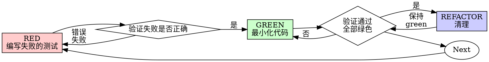

<!--
本文件由智谱 AI 自动翻译生成
原文件: SKILL.md
翻译时间: 2025-12-12 16:11:34
翻译模型: glm-4-flash
原文大小: 9,726 字符
-->

---
name: test-driven-development
description: 在实现任何功能或修复错误之前使用，先编写实现代码 - 先编写测试，观察它失败，编写最小化代码使其通过；确保测试通过要求先失败来实际验证行为
---

# 测试驱动开发 (TDD)

## 概述

先编写测试。观察它失败。编写最小化代码使其通过。

**核心原则：** 如果你没有看到测试失败，你就不知道它是否测试了正确的东西。

**违反规则的字面意思就是违反规则的精神。**

## 何时使用

**始终：**
- 新功能
- 错误修复
- 重构
- 行为变更

**例外情况（询问你的合作伙伴）：**
- 一次性原型
- 生成代码
- 配置文件

思考“这次就跳过TDD”？停止。那是合理化。

## 铁律

```
没有失败的测试，就没有生产代码
```

在编写测试之前编写代码？删除它。重新开始。

**没有例外：**
- 不要保留为“参考”
- 不要在编写测试时“适应”它
- 不要看它
- 删除意味着删除

从测试中新鲜实现。就这样。

## 红绿重构



### RED - 编写失败的测试

编写一个最小化的测试，显示应该发生什么。

<Good>
```typescript
test('重试失败的操作3次', async () => {
  let attempts = 0;
  const operation = () => {
    attempts++;
    if (attempts < 3) throw new Error('fail');
    return 'success';
  };

  const result = await retryOperation(operation);

  expect(result).toBe('success');
  expect(attempts).toBe(3);
});
```
清晰的名称，测试真实的行为，一件事
</Good>

<Bad>
```typescript
test('重试工作', async () => {
  const mock = jest.fn()
    .mockRejectedValueOnce(new Error())
    .mockRejectedValueOnce(new Error())
    .mockResolvedValueOnce('success');
  await retryOperation(mock);
  expect(mock).toHaveBeenCalledTimes(3);
});
```
模糊的名称，测试模拟而不是代码
</Bad>

**要求：**
- 一个行为
- 清晰的名称
- 真实的代码（除非不可避免，不要使用模拟）

### Verify RED - 观察它失败

**强制性的。永远不要跳过。**

```bash
npm test path/to/test.test.ts
```

确认：
- 测试失败（不是错误）
- 失败信息是预期的
- 失败是因为功能缺失（不是错误）

**测试通过？** 你正在测试现有行为。修复测试。

**测试错误？** 修复错误，重新运行直到它正确失败。

### GREEN - 最小化代码

编写最简单的代码以通过测试。

<Good>
```typescript
async function retryOperation<T>(fn: () => Promise<T>): Promise<T> {
  for (let i = 0; i < 3; i++) {
    try {
      return await fn();
    } catch (e) {
      if (i === 2) throw e;
    }
  }
  throw new Error('unreachable');
}
```
刚好足够通过
</Good>

<Bad>
```typescript
async function retryOperation<T>(
  fn: () => Promise<T>,
  options?: {
    maxRetries?: number;
    backoff?: 'linear' | 'exponential';
    onRetry?: (attempt: number) => void;
  }
): Promise<T> {
  // YAGNI
}
```
过度设计
</Bad>

不要添加功能，重构其他代码，或“改进”超出测试的范围。

### Verify GREEN - 观察它通过

**强制性的。**

```bash
npm test path/to/test.test.ts
```

确认：
- 测试通过
- 其他测试仍然通过
- 输出纯净（没有错误，警告）

**测试失败？** 修复代码，而不是测试。

**其他测试失败？** 现在修复。

### REFACTOR - 清理

仅在绿色之后：
- 删除重复内容
- 改进名称
- 提取辅助函数

保持测试绿色。不要添加行为。

### 重复

下一个失败的测试用于下一个功能。

## 好的测试

| 质量 | 好 | 差 |
|------|----|----|
| **最小化** | 一件事。名称中有“和”吗？拆分它。 | `test('验证电子邮件和域名和空格')` |
| **清晰** | 名称描述行为 | `test('test1')` |
| **显示意图** | 展示期望的API | 隐藏代码应该做什么 |

## 为什么顺序很重要

**“我会在之后编写测试来验证它是否工作”**

编写在代码之后的测试会立即通过。立即通过并不能证明什么：
- 可能测试了错误的东西
- 可能测试了实现，而不是行为
- 可能遗漏了你忘记的边缘情况
- 你从未看到它捕获错误

测试优先迫使你看到测试失败，证明它实际上测试了某些东西。

**“我已经手动测试了所有的边缘情况”**

手动测试是临时的。你认为你测试了一切，但：
- 没有测试你测试了什么的记录
- 无法在代码更改时重新运行
- 在压力下容易忘记情况
- “我试过它了”≠全面

自动测试是系统的。它们每次都以相同的方式运行。

**“删除X小时的工作是浪费的”**

沉没成本谬误。时间已经过去了。你现在可以选择：
- 删除并使用TDD重新编写（X更多小时，高信心）
- 保留它并在之后添加测试（30分钟，低信心，可能存在错误）

“浪费”是保留你无法信任的代码。没有真实测试的工作代码是技术债务。

**“TDD是教条主义，实用主义意味着适应”**

TDD是实用的：
- 在提交之前发现错误（比调试后更快）
- 防止回归（测试立即捕获中断）
- 记录行为（测试显示如何使用代码）
- 使重构成为可能（自由更改，测试捕获中断）

“实用主义”的捷径=生产环境中的调试=更慢。

**“之后的测试达到相同的目标 - 它是精神而不是仪式”**

不。之后的测试回答“这做什么？”测试优先回答“这应该做什么？”

之后的测试受你的实现偏倚。你测试了你构建的，而不是所需的。你验证了你记住的边缘情况，而不是发现的边缘情况。

测试优先在实现之前强制发现边缘情况。之后的测试验证了你记得一切（你没有）。

之后的30分钟测试≠TDD。你得到覆盖率，失去了证明测试工作的证据。

## 常见合理化

| 借口 | 现实 |
|------|------|
| “太简单了，无法测试” | 简单的代码会出错。测试只需要30秒。 |
| “我会在之后测试” | 测试立即通过并不能证明什么。 |
| “之后的测试达到相同的目标” | 之后的测试=“这做什么？”测试优先=“这应该做什么？” |
| “已经手动测试了” | 临时的。没有测试你测试了什么的记录。 |
| “删除X小时是浪费的” | 沉没成本谬误。时间已经过去了。 |
| “保留为参考，先编写测试” | 你会适应它。那是之后的测试。删除意味着删除。 |
| “需要先探索” | 好的。丢弃探索，用TDD开始。 |
| “测试很难=设计不清楚” | 倾听测试。难以测试=难以使用。 |
| “TDD会减慢我” | TDD比调试更快。实用主义=测试优先。 |
| “手动测试更快” | 手动测试不能证明边缘情况。你将重新测试每次更改。 |
| “现有代码没有测试” | 你正在改进它。为现有代码添加测试。 |

## 红旗 - 停止并重新开始

- 在测试之前编写代码
- 在实现之后测试
- 测试立即通过
- 无法解释为什么测试失败
- 测试添加“之后”
- 合理化“就这一次”
- “我已经手动测试了它”
- “之后的测试达到相同的目的”
- “它是关于精神而不是仪式”
- “保留为参考”或“适应现有代码”
- “已经花费了X小时，删除是浪费的”
- “TDD是教条主义，我正在实用主义”
- “这不同，因为……”

**所有这些都意味着：删除代码。用TDD重新开始。**

## 示例：错误修复

**错误：** 空电子邮件被接受

**RED**
```typescript
test('拒绝空电子邮件', async () => {
  const result = await submitForm({ email: '' });
  expect(result.error).toBe('电子邮件必填');
});
```

**Verify RED**
```bash
$ npm test
FAIL: expected '电子邮件必填', got undefined
```

**GREEN**
```typescript
function submitForm(data: FormData) {
  if (!data.email?.trim()) {
    return { error: '电子邮件必填' };
  }
  // ...
}
```

**Verify GREEN**
```bash
$ npm test
PASS
```

**REFACTOR**
如果需要，提取多个字段的验证。

## 验证清单

在标记工作完成之前：

- [ ] 每个新的函数/方法都有一个测试
- [ ] 在实现之前观察了每个测试失败
- [ ] 每个测试都因预期原因失败（功能缺失，不是错误）
- [ ] 编写了最小化代码以通过每个测试
- [ ] 所有测试都通过
- [ ] 输出纯净（没有错误，警告）
- [ ] 测试使用真实代码（除非不可避免，不要使用模拟）
- [ ] 边缘情况和错误都得到了覆盖

无法勾选所有复选框？你跳过了TDD。重新开始。

## 当遇到困难时

| 问题 | 解决方案 |
|------|----------|
| 不知道如何测试 | 编写期望的API。先编写断言。询问你的合作伙伴。 |
| 测试太复杂 | 设计太复杂。简化接口。 |
| 必须模拟一切 | 代码耦合太紧。使用依赖注入。 |
| 测试设置太大 | 提取辅助函数。仍然复杂？简化设计。 |

## 调试集成

发现错误？编写一个失败的测试来重现它。遵循TDD周期。测试证明修复并防止回归。

永远不要在没有测试的情况下修复错误。

## 最终规则

```
生产代码 → 测试存在且首先失败
否则 → 不是TDD
```

未经你的合作伙伴许可，没有例外。