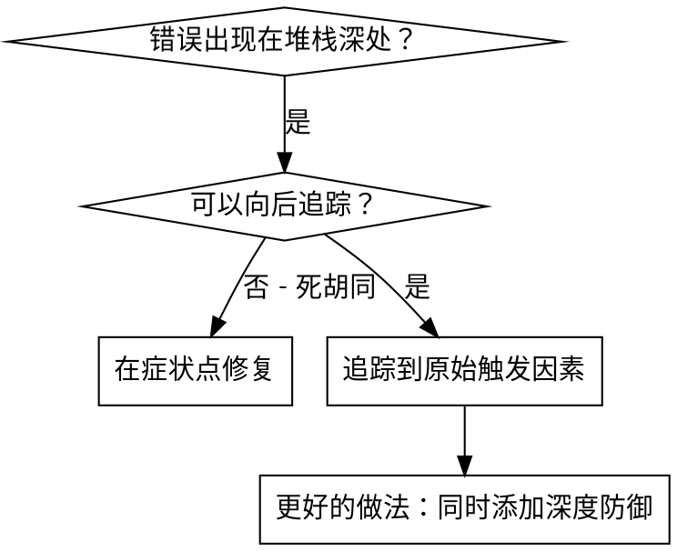
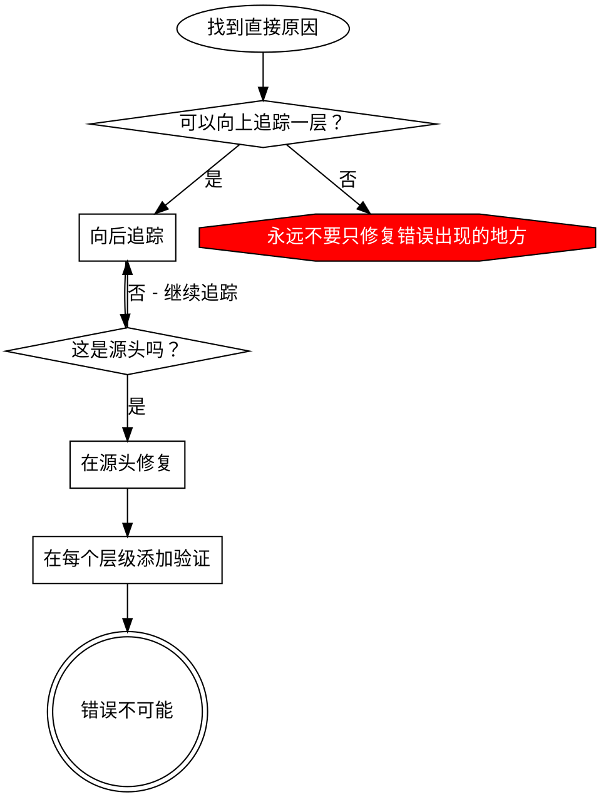

<!--
本文件由智谱 AI 自动翻译生成
原文件: SKILL.md
翻译时间: 2025-12-12 16:11:28
翻译模型: glm-4-flash
原文大小: 5,594 字符
-->

---
name: root-cause-tracing
description: 使用于执行过程中发生错误且需要回溯以找到原始触发因素时 - 系统性地通过调用堆栈向后追踪错误，在需要时添加检测工具，以确定无效数据或错误行为的来源
---

# 原因追踪

## 概述

错误通常在调用堆栈深处显现（在错误的目录中运行 git init，在错误的地点创建文件，使用错误的路径打开数据库）。你的直觉是修复错误出现的地方，但这只是治标不治本。

**核心原则：** 通过调用链向后追踪，直到找到原始触发因素，然后在源头进行修复。

## 何时使用



**使用场景：**
- 错误发生在执行深处（不在入口点）
- 调用堆栈显示长的调用链
- 不清楚无效数据起源于何处
- 需要找到哪个测试/代码触发了问题

## 追踪过程

### 1. 观察症状
```
错误：git init 在 /Users/jesse/project/packages/core 失败
```

### 2. 找到直接原因
**什么代码直接导致了这个问题？**
```typescript
await execFileAsync('git', ['init'], { cwd: projectDir });
```

### 3. 问：什么调用了这个？
```typescript
WorktreeManager.createSessionWorktree(projectDir, sessionId)
  → 被 Session.initializeWorkspace() 调用
  → 被 Session.create() 调用
  → 被测试 Project.create() 调用
```

### 4. 继续向上追踪
**传递了什么值？**
- `projectDir = ''`（空字符串！）
- 空字符串作为 `cwd` 解析为 `process.cwd()`
- 那就是源代码目录！

### 5. 找到原始触发因素
**空字符串从哪里来的？**
```typescript
const context = setupCoreTest(); // 返回 { tempDir: '' }
Project.create('name', context.tempDir); // 在 beforeEach 之前访问！
```

## 添加堆栈跟踪

当你无法手动追踪时，添加检测工具：

```typescript
// 在有问题的操作之前
async function gitInit(directory: string) {
  const stack = new Error().stack;
  console.error('DEBUG git init:', {
    directory,
    cwd: process.cwd(),
    nodeEnv: process.env.NODE_ENV,
    stack,
  });

  await execFileAsync('git', ['init'], { cwd: directory });
}
```

**关键：** 在测试中使用 `console.error()`（而不是记录器 - 可能不会显示）

**运行并捕获：**
```bash
npm test 2>&1 | grep 'DEBUG git init'
```

**分析堆栈跟踪：**
- 查找测试文件名
- 找到触发调用的行号
- 识别模式（相同的测试？相同的参数？）

## 找到导致污染的测试

如果测试期间出现了一些东西，但你不知道是哪个测试：

使用二分查找脚本：@find-polluter.sh

```bash
./find-polluter.sh '.git' 'src/**/*.test.ts'
```

逐个运行测试，在第一个污染者处停止。请参阅脚本以了解用法。

## 实际示例：空的 projectDir

**症状：** `.git` 在 `packages/core/`（源代码）中创建

**追踪链：**
1. `git init` 在 `process.cwd()` 中运行 ← 空的 cwd 参数
2. WorktreeManager 使用空的 projectDir 被调用
3. Session.create() 传递了空字符串
4. 测试在 beforeEach 之前访问了 `context.tempDir`
5. setupCoreTest() 初始返回 `{ tempDir: '' }`

**根本原因：** 顶层变量初始化访问了空值

**修复：** 将 tempDir 制作为一个 getter，如果在其之前访问则抛出异常

**还添加了深度防御：**
- 层 1：Project.create() 验证目录
- 层 2：WorkspaceManager 验证不为空
- 层 3：NODE_ENV 守卫拒绝在 tmpdir 之外进行 git init
- 层 4：在 git init 之前记录堆栈跟踪

## 关键原则



**永远不要只修复错误出现的地方。** 追溯以找到原始触发因素。

## 堆栈跟踪提示

**在测试中：** 使用 `console.error()` 而不是记录器 - 记录器可能被抑制
**在操作之前：** 在危险操作之前记录，而不是在它失败之后
**包含上下文：** 目录、cwd、环境变量、时间戳
**捕获堆栈：** `new Error().stack` 显示完整的调用链

## 实际影响

从调试会话（2025-10-03）：
- 通过 5 级追踪找到根本原因
- 在源头修复（getter 验证）
- 添加了 4 层防御
- 1847 个测试通过，零污染